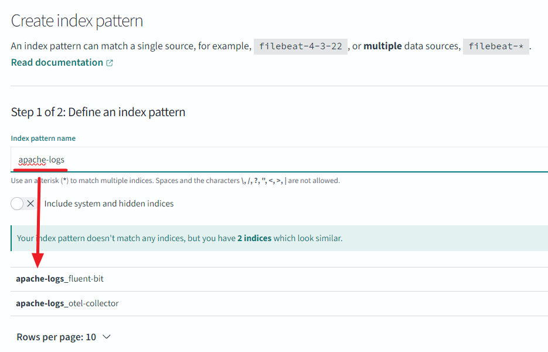

# 2024년 Weekly #01 | 로그 수집 시스템 구축하기

## 개요
- opensearch 오픈소스를 이용하여 로그 수집 시스템을 구축한다.
  - 소스: [링크](./W01-Log/)

## 배움
- fluent-bit을 이용한 로그 파일 수집과 전송 방법을 이해한다.
  - stdout
  - http
  - opentelemetry
- data-prepper 다중 pipeline을 이용하여 apache 로그 해석기를 개발한다.
  - parse_json
  - grok
  - 2.6.1 버전에서는 멀티 source을 제공하지 않는다: [Support multiple sources for a pipeline](https://github.com/opensearch-project/data-prepper/issues/406)
- otel-collector을 이용하여 fluent-bit와 data-prepper을 중계한다.

## 시스템 구성
```
# Case 1.
fluent-bit ---------------------> data-prepper -> opensearch -> opensearch dashboards
test.log                          21892           9200          5601

# Case 2.
fluent-bit --> otel-collector --> data-prepper -> opensearch -> opensearch dashboards
test.log       8080               21892           9200          5601
```


## 사전 준비
### WSL2 설정
- `%userprofile%.wslconfig` 파일
  ```ini
  [wsl2]
  memory=6GB
  swap=0
  kernelCommandLine="sysctl.vm.max_map_count=262144"
  ```
  - `swap=0` swapping 비활성화
  - `kernelCommandLine="sysctl.vm.max_map_count=262144"` 최대 맵 카운트 설정
- [OpenSearch 중요 설정](https://opensearch.org/docs/latest/install-and-configure/install-opensearch/docker/#important-host-settings)
  - Disable memory paging and swapping: `swap=0`
  - Increase the number of memory maps available: `kernelCommandLine="sysctl.vm.max_map_count=262144"`

## 실행
```shell
# 컨테이너 실행
docker-compose up -d

# 로그 테이터 추가
echo '63.173.168.120 - - [04/Nov/2021:15:07:25 -0500] "GET /search/tag/list HTTP/1.0" 200 5003' >> test.log

# 로그 데이터 확인
#   http://localhost:5601
#   admin/admin
```

## 로그 데이터
### 입력 데이터
> echo '63.173.168.120 - - [04/Nov/2021:15:07:25 -0500] "GET /search/tag/list HTTP/1.0" 200 5003' >> test.log

### fluent-bit → data-prepper 데이터
```json
{
    "date": 1.704428472506444E9,

    "log": "63.173.168.120 - - [04/Nov/2021:15:07:25 -0500] \"GET /search/tag/list HTTP/1.0\" 200 5003",
    "request": "/search/tag/list",
    "auth": "-",
    "ident": "-",
    "response": "200",
    "bytes": "5003",
    "clientip": "63.173.168.120",
    "verb": "GET",
    "httpversion": "1.0",
    "timestamp": "04/Nov/2021:15:07:25 -0500"
}
```
```
  processor:
    - grok:
        match:
          log: [ "%{COMMONAPACHELOG}" ]
```

### fluent-bit → otel-collector → data-prepper 데이터
```json
{
    "traceId": "",
    "spanId": "",
    "severityText": "",
    "flags": 0,
    "time": "2024-01-05T04:21:12.506443400Z",
    "severityNumber": 0,
    "droppedAttributesCount": 0,
    "serviceName": null,
    "observedTime": "1970-01-01T00:00:00Z",
    "schemaUrl": "",
    "body": "{\"log\":\"63.173.168.120 - - [04/Nov/2021:15:07:25 -0500] \\\"GET /search/tag/list HTTP/1.0\\\" 200 5003\"}",

    "log": "63.173.168.120 - - [04/Nov/2021:15:07:25 -0500] \"GET /search/tag/list HTTP/1.0\" 200 5003",
    "request": "/search/tag/list",
    "auth": "-",
    "ident": "-",
    "response": "200",
    "bytes": "5003",
    "clientip": "63.173.168.120",
    "verb": "GET",
    "httpversion": "1.0",
    "timestamp": "04/Nov/2021:15:07:25 -0500"
}
```
```
  processor:
    - parse_json:
        source: "body"
        pointer: "log"
    - grok:
        match:
          log: [ "%{COMMONAPACHELOG}" ]
```

<br/>

## OpenSearch

