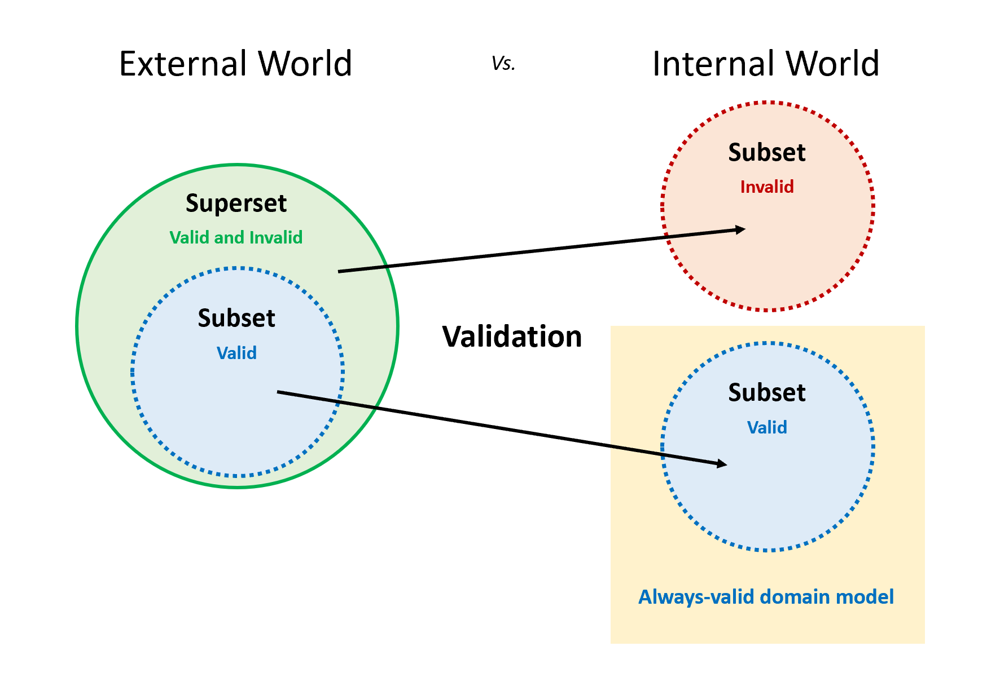

# 2024년 Weekly #02 | 유효성 검사는 매핑입니다(개념 1/3)

## Always-valid domain model



> Validation is the process of **mapping a set onto its subset**.
> 유효성 검사는 큰 집합에서 작은 집합으로 매핑하는 것입니다.

```shell
# Validation 성공일 때
External world      --Validation-> Internal world              --No Validation--> External World
Superset                           Subset                                         Superset
Not-always-valid                   Always-valid domain model                      Not-always-valid

# Validation 실패일 때
External world      --Validation------------------------------------------------> External World
Superset                                                                          Superset
Not-always-valid                                                                  Not-always-valid
```

