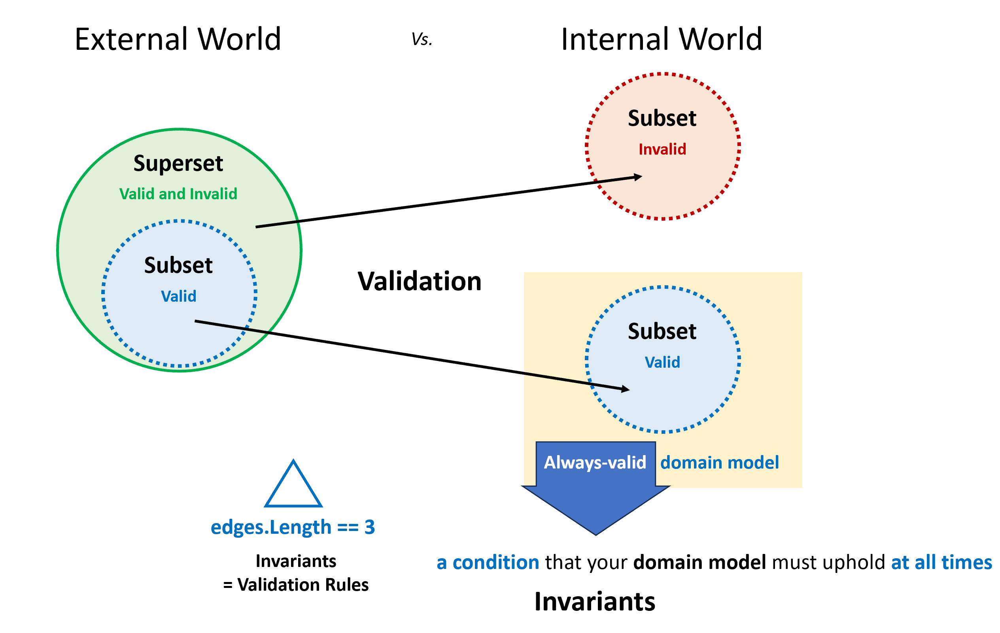

# 2024년 Weekly #02 | 유효성 검사 규칙은 도메인 지식이다(개념 2/3)

> **Always-valid** domain model  
> - 유효성 검사 규칙은 도메인 모델이 **항상 지켜야할 조건입니다(불변)**.
> - 도메인 모델을 정의하는 조건이다(불변).

- Validation rules are invariants
  - = Invariants are the reason validation exists