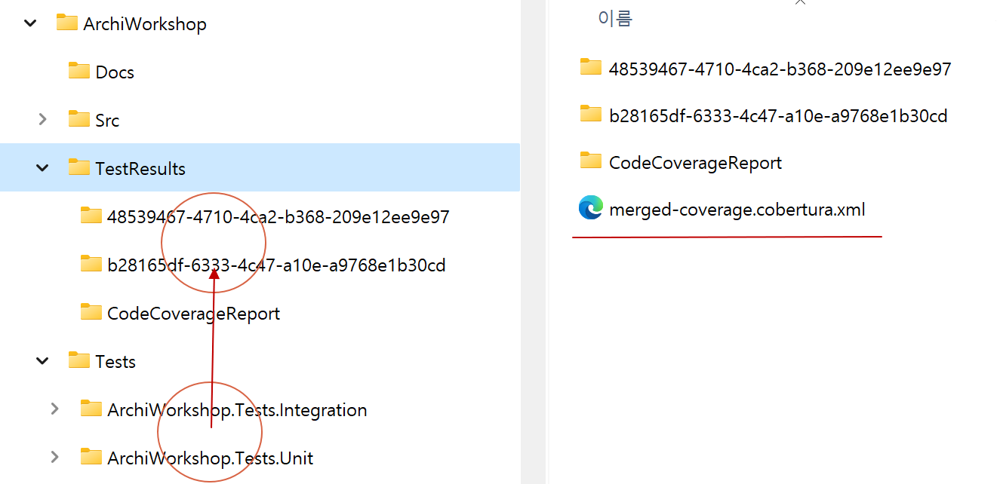

# 2024년 Weekly #03 | 로컬 코드 커버리지

CI 스크립트: [Build.ps1](./Build.ps1)

## dotnet 도구 설치
```shell
# 전역 도구 목록 확인하기
dotnet tool list -g

# 전역 도구 설치
dotnet tool install -g dotnet-coverage
dotnet tool install -g dotnet-reportgenerator-globaltool

# 전역 도구 업데이트
dotnet tool update -g dotnet-coverage
dotnet tool update -g dotnet-reportgenerator-globaltool

# 패키지 ID                              버전           명령
# --------------------------------------------------------------------
# dotnet-coverage                        17.9.6        dotnet-coverage
# dotnet-reportgenerator-globaltool      5.2.0         reportgenerator
```

## 코드 커버리지
### 개요
- 이전 테스트 결과는 모두 삭제 후 시작한다.
- 테스트 프로젝트에 생성되는 모든 테스트 결과를 TestResults 폴더에 생성 시킨다.
- 모든 테스트 결과를 1개 파일로 머지한다.
- 머지된 테스트 결과 기준으로 코드 커버리지 HTML 보고서를 생성한다.

### 폴더 구성


```
/솔루션                                             // 솔루션 Root
    솔루션.sln
    /TestResults                                    // 테스트 자동화 결과
        /19f5be57-f7f1-4902-a22d-ca2dcd8fdc7a       // dotnet test 수행 결과(코드 커버리지 N개)
            /coverage.cobertura.xml

        /merged-coverage.cobertura.xml              // dotnet-coverage: Merged 코드 커버리지

        /CodeCoverageReport                         // ReportGenerator: 코드 커버리지 Html, Badges
            /...
```

### CLI
```shell
#
# .sln 파일이 있는 곳에서 CLI 명령을 실행합니다.
#

$current_dir = Get-Location
$testResults_dir = Join-Path -Path $current_dir -ChildPath "TestResults"

if (Test-Path -Path $testResults_dir) {
    Remove-Item -Path (Join-Path -Path $testResults_dir -ChildPath "*") -Recurse -Force
}
dotnet restore $current_dir

dotnet build $current_dir --no-restore --configuration Release --verbosity m

dotnet test `
    --configuration Release `
    --results-directory $testResults_dir `
    --no-build `
    --collect "XPlat Code Coverage" `
    --verbosity normal

dotnet-coverage merge (Join-Path -Path $testResults_dir -ChildPath "**/*.cobertura.xml") `
    -f cobertura `
    -o (Join-Path -Path $testResults_dir -ChildPath "merged-coverage.cobertura.xml")

reportgenerator `
	-reports:(Join-Path -Path $testResults_dir -ChildPath "merged-coverage.cobertura.xml") `
	-targetdir:(Join-Path -Path $testResults_dir -ChildPath "CodeCoverageReport") `
	-reporttypes:"Html;Badges" `
    -verbosity:Info

```