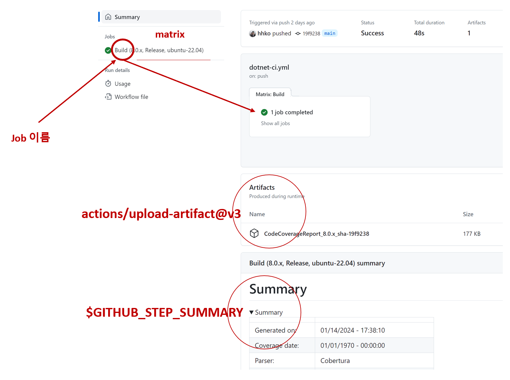

# 2024년 Weekly #03 | GitHub Actions 코드 커버리지

- CI 스크립트: [dotnet-ci.yml](https://github.com/hhko/ArchiWorkshop/blob/main/.github/workflows/dotnet-ci.yml)

## CI 파일 위치
```
{GitHub 저장소}/.github/workflows
    /{파일명}.yml
```

## 코드 커버리지
### 폴더 구성
```
  /home/runner/work/{저장소}
    /{저장소}                                           // 저장소 Root
    /{폴더}
    /{솔루션 폴더}                                      // 솔루션 Root
       /TestResults                                    // 테스트 자동화 결과
           /19f5be57-f7f1-4902-a22d-ca2dcd8fdc7a       // dotnet test: 코드 커버리지 N개           <- Artifacts 업로드
               /coverage.cobertura.xml

               /merged-coverage.cobertura.xml          // dotnet-coverage: Merged 코드 커버리지

               /CodeCoverageReport                     // ReportGenerator: 코드 커버리지 Markdown  <- Summary 업로드
                   /SummaryGithub.md
```



### Actions 패키지
- actions/checkout@v3
- actions/setup-dotnet@v3
- danielpalme/ReportGenerator-GitHub-Action@5.2.0
- actions/upload-artifact@v3

### GitHub 환경 변수
- $GITHUB_OUTPUT
- $GITHUB_STEP_SUMMARY

### dotnet 명령어
- dotnet restore
- dotnet build
- dotnet test
- dotnet tool install -g
- dotnet-coverage merge


## CI 소스
```yml
# This workflow will build a .NET project
# For more information see: https://docs.github.com/en/actions/automating-builds-and-tests/building-and-testing-net

name: "ArchiWorkshop CI"

# TODO: PR일 때 코드 커버리지 댓글 추가
on:
  push:
    branches: [ "main" ]
    paths: [ 'Projects/ArchiWorkshop/Src/**', 'Projects/ArchiWorkshop/Tests/**', '.github/workflows/dotnet-ci.yml' ]
    # TODO: 특정 확장자 Actions 제외
    # paths-ignore:
    #     - '**.md'
    #     - '**.pptx'
    #     - '**.png'

jobs:
  build:
    name: Build

    # 빌드 환경 경우의 수 정의
    strategy:
        matrix:
            dotnet-version: [ '8.0.x' ]
            configuration: [ Release ]
            os: [ ubuntu-22.04 ]

    # 빌드 환경 지정
    runs-on: ${{ matrix.os }}
    #runs-on: ubuntu-22.04

    # 환경 변수
    #  - 규칙: ${{ env.환경_변수_이름 }}
    #  - 예제: ${{ env.solution_dir }}
    env:
        solution_dir: ./Projects/ArchiWorkshop
        solution_path: ./Projects/ArchiWorkshop/ArchiWorkshop.sln

    steps:
        # 형상관리 최신 소스 받기
        - name: Checkout
          uses: actions/checkout@v3

        # Git Commit SHA 얻기
        #   - Deprecating save-state and set-output commands: https://github.blog/changelog/2022-10-11-github-actions-deprecating-save-state-and-set-output-commands/
        #   - GitHub Actions에서 output 변수의 문법 변경: https://blog.outsider.ne.kr/1651
        #   - Github Actions and creating a short SHA hash: https://dev.to/hectorleiva/github-actions-and-creating-a-short-sha-hash-8b7
        #
        # 동적 변수 만들기
        # 규칙 1. $GITHUB_OUTPUT은 "steps.vars.outputs"을 지정한다.
        # 규칙 2. "키=값" 형식으로 outputs을 정의한다.
        # 예. ${{ steps.vars.outputs.short_sha }}
        - name: Set short git commit SHA
          id: vars
          run: |
            calculatedSha=$(git rev-parse --short ${{ github.sha }})
            echo "short_sha=$calculatedSha" >> $GITHUB_OUTPUT

        # .NET SDK 설치
        - name: Setup .net sdk ${{ matrix.dotnet-version }}
          uses: actions/setup-dotnet@v3
          with:
            dotnet-version: ${{ matrix.dotnet-version }}

        # 패키지 복원
        - name: Restore nuget packages
          run: |
            dotnet restore ${{ env.solution_path }}

        # 빌드
        - name: Build
          run: |
            dotnet build ${{ env.solution_path }} \
                --configuration ${{ matrix.configuration }} \
                --no-restore

        #
        # 테스트 결과 폴더 구성
        #
        #  /home/runner/work/ArchiWorkshop
        #    /ArchiWorkshop                                     // 저장소 Root
        #    /Projects
        #    /ArchiWorkshop                                     // 솔루션 Root
        #       /TestResults                                    // 테스트 자동화 결과
        #           /19f5be57-f7f1-4902-a22d-ca2dcd8fdc7a       // dotnet test: 코드 커버리지 N개           <- Artifacts 업로드
        #               /coverage.cobertura.xml
        #
        #               /merged-coverage.cobertura.xml          // dotnet-coverage: Merged 코드 커버리지
        #
        #               /CodeCoverageReport                     // ReportGenerator: 코드 커버리지 Markdown  <- Summary 업로드
        #                   /SummaryGithub.md

        # 테스트와 코드 커버리지 coverage.cobertura.xml 파일 생성
        #   - name: Find coverage output path
        #     run: |
        #       cp $(find . -name "coverage.cobertura.xml") .
        - name: Test
          run: |
            dotnet test ${{ env.solution_path }} \
                --configuration ${{ matrix.configuration }} \
                --results-directory ${{ env.solution_dir }}/TestResults \
                --no-build \
                --collect "XPlat Code Coverage" \
                --verbosity normal

        # dotnet-coverage 도구 설치
        - name: Install dotnet-coverage
          run: dotnet tool install -g dotnet-coverage

        # N개 coverage.cobertura.xml 파일을 머지한 코드 커버리지 merged-coverage.cobertura.xml 파일 생성
        - name: Convert .coverage report to cobertura
          run: |
            dotnet-coverage merge ${{ env.solution_dir }}/TestResults/**/*.cobertura.xml \
                -f cobertura \
                -o ${{ env.solution_dir }}/TestResults/merged-coverage.cobertura.xml

        # merged-coverage.cobertura.xml 파일 기반으로 코드 커버리지 SummaryGithub.md 파일 생성
        - name: Create coverage markdown file
          uses: danielpalme/ReportGenerator-GitHub-Action@5.2.0
          with:
            reports: '${{ env.solution_dir }}/TestResults/merged-coverage.cobertura.xml'
            targetdir: '${{ env.solution_dir }}/TestResults/CodeCoverageReport'
            reporttypes: 'MarkdownSummaryGithub'

        # 코드 커버리지 SummaryGithub.md 파일 Summary 업로드
        - name: Upload coverage markdown into github actions summary
          run: cat ${{ env.solution_dir }}/TestResults/CodeCoverageReport/SummaryGithub.md >> $GITHUB_STEP_SUMMARY

        # N개 코드 커버리지 coverage.cobertura.xml 파일을 압축하여 Artifacts 업로드
        - name: Upload coverage files into github actions artifacts
          uses: actions/upload-artifact@v3
          with:
            name: CodeCoverageReport_${{ matrix.dotnet-version }}_sha-${{ steps.vars.outputs.short_sha }}
            path: ${{ env.solution_dir }}/TestResults/**/*.cobertura.xml
```