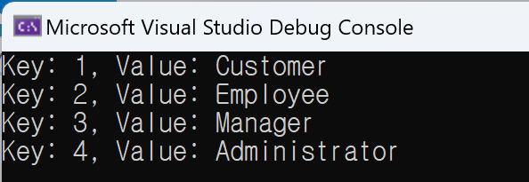

# 2024년 Weekly #04 | Enumeration 값 객체 만들기(IEnumerable 객체 생성하기)

```cs
using System.Data;
using System.Reflection;

IEnumerable<Role> roles = Enumeration<Role>.GetFieldsForType(typeof(Role));
foreach (var role in roles)
{
    Console.WriteLine($"Key: {role.Id}, Value: {role.Name}");
}

class Role : Enumeration<Role>
{
    public static readonly Role Customer = new(1, nameof(Customer));
    public static readonly Role Employee = new(2, nameof(Employee));
    public static readonly Role Manager = new(3, nameof(Manager));
    public static readonly Role Administrator = new(4, nameof(Administrator));

    public int Id { get; init; }
    public string Name { get; init; }

    public Role(int id, string name)
    {
        Id = id;
        Name = name;
    }
}

public class Enumeration<TEnum>
    where TEnum : Enumeration<TEnum>
{
    public static IEnumerable<TEnum> GetFieldsForType(Type enumType)
    {
        return enumType
            // public static 필드 검색
            // 모든 상위 타입에 대해 멤버를 검색
            .GetFields(BindingFlags.Public | BindingFlags.Static | BindingFlags.FlattenHierarchy)
            // enumType과 할당 호환되는 필드만 선택
            .Where(fieldInfo => enumType.IsAssignableFrom(fieldInfo.FieldType))
            // 생성
            .Select(fieldInfo => (TEnum)fieldInfo.GetValue(default)!);
    }
}
```
