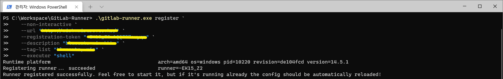
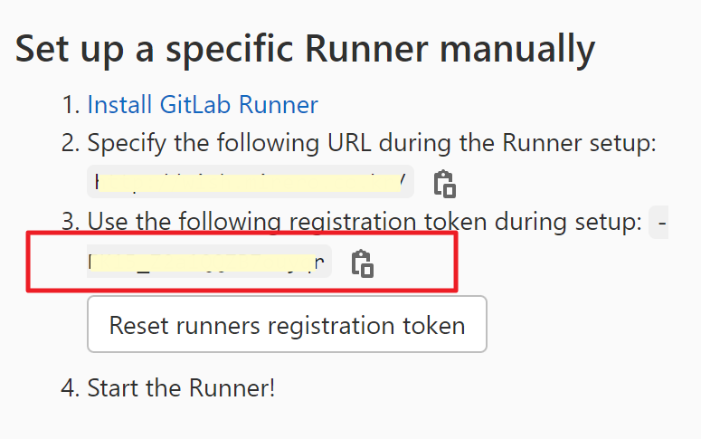
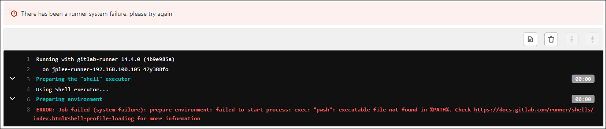
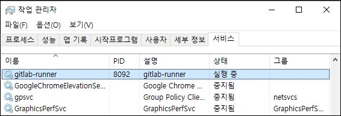
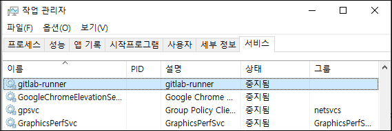
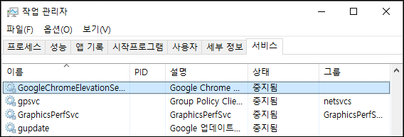

## GitLab Runner 설치 요약
```powershell
# 1/8. Runner 다운로드 : https://gitlab.com/gitlab-org/gitlab-runner/-/releases
gitlab-runner-windows-amd64.exe

# 2/8. 폴더 구성
C:\Workspace\GitLab-Runner\gitlab-runner-windows-amd64.exe

# 3/8. Runner 파일명 변경 : gitlab-runner-windows-amd64.exe -> gitlab-runner.exe
C:\Workspace\GitLab-Runner\gitlab-runner.exe

# 4/8. Runner 버전 확인
.\gitlab-runner.exe --version

# 5/8. Runner 서버 등록 : 관리자 권한 Shell(공백 제거)
.\gitlab-runner.exe register `                   # Runner 등록 명령
   --non-interactive `                           # Runner 등록 과정 대화식(하나씩 입력하는 것) 중식
   --url "https://{URL}/" `                      # Runner 등록할 서버 URL
   --registration-token "{Token}" `              # Runner 등록키 : GitLab 관리자 문의(저장자 고유 값)
   --description "{RunnerName}" `                # Runner 이름 : 개별 작성
   --tag-list "{Tag1}, {Tag2}" `                 # Runner 식별 키워드 : 개별 작성(`,`으로 구분하여 복수개 입력 가능)
   --executor "shell" `                          # Runner 실행자 : 예. shell, docker
   --shell "powershell"                          # Runner 실행 Shell 이름 : 예. powershell, bash
#
# 등록이 성공할 때 출력 메시지
# Runner registered successfully. Feel free to start it, but if it's running already the config should be automatically reloaded!
# 

# 6/8. Runner 서버 등록 확인
# --registration-token 저장소 > 메뉴 > Settings > CI/CD > Runners

# 7/8. Runner 명령
.\gitlab-runner.exe install                            # Runner 설치
.\gitlab-runner.exe start                              # Runner 서비스 시작
.\gitlab-runner.exe stop                               # Runner 서비스 중지
.\gitlab-runner.exe uninstall                          # Runner 제거

# 8/8. Git too long 에러 해결
# warning: failed to remove ... .cache: Filename too lon
git config --system core.longpaths true # 시스템 설정
git config --global core.longpaths true # 전역 설정
```

## GitLab Runner 환경
### GitLab Runner 다운로드
- 최신 버전 다운로드
  - [gitlab-runner-windows-amd64.exe](https://gitlab-runner-downloads.s3.amazonaws.com/latest/binaries/gitlab-runner-windows-amd64.exe)
  - [gitlab-runner-windows-386.exe](https://gitlab-runner-downloads.s3.amazonaws.com/latest/binaries/gitlab-runner-windows-386.exe)
- 그 외 버전 다운로드
  - [GitLab Runner Releases](https://gitlab.com/gitlab-org/gitlab-runner/-/releases)

### GitLab Runner 구성
- 폴더 구성
  ```shell
  C:\Workspace\GitLab-Runner\gitlab-runner.exe
  ```
- GitLab Runner 파일명 변경
  - 변경 전 : `gitlab-runner-windows-amd64.exe`
  - 변경 후 : `gitlab-runner.exe`
- GitLab Runner 버전 확인
  ```powershell
  PS C:\Workspace\GitLab-Runner> .\gitlab-runner --version
  Version:      14.5.1
  Git revision: de104fcd
  Git branch:   14-5-stable
  GO version:   go1.13.8
  Built:        2021-12-01T15:41:35+0000
  OS/Arch:      windows/amd64
  ```

<br/>  

## GitLab Runner 등록
### Non Interactive 등록


```shell
.\gitlab-runner.exe register `
   --non-interactive `
   --url "https://{URL}/" `
   --registration-token "{Token}" `
   --description "{RunnerName}" `
   --tag-list "{Tag2}, {Tag2}" `
   --executor "shell" `
   --shell "powershell"
```
- 옵션
  - `-n`, `--non-interactive`  
    Run registration unattended [%REGISTER_NON_INTERACTIVE%]
  - `-u` value, `--url` value  
    Runner URL [%CI_SERVER_URL%]
  - `-r` value, `--registration-token` value  
    Runner's registration token [%REGISTRATION_TOKEN%]  
    
  - `--name` value, `--description` value  
    Runner name (default: "DESKTOP-FAOR0RM") [%RUNNER_NAME%]
  - `--tag-list` value  
    Tag list [%RUNNER_TAG_LIST%]
  - `--executor` value  
    Select executor, eg. shell, docker, etc. [%RUNNER_EXECUTOR%]
- 등록 확인 : `Repository` > `Settings` > `CI/CD` > `Runner`    
- 빌드 옵션 변경(선택 사항) : Tag 없이 CI/CD 동작할 수 있도록 변경하기  
  ```
  Run untagged jobs: [x] Indicates whether this runner can pick jobs without tags
  ```

### Interactive 등록

```shell
gitlab-runner.exe register                        # Runner 설치 명령
  Enter the GitLab instance URL (for example, https://gitlab.com/):  
    https://{URL}/                                # Runner 등록할 서버 URL
  Enter the registration token:  
    {Token}                                       # Runner 등록키
  Enter a description for the runner:  
    [{hostname}]: {RunnerName}                    # Runner 이름
  Enter tags for the runner (comma-separated):  
    {Tag1}, {Tag2}                                # Runner 식별 키워드
  Registering runner... succeeded                     runner=-EK15_Z2
  Enter an executor: docker, docker-ssh, parallels, ssh, docker+machine, kubernetes, custom, docker-windows, shell, virtualbox, docker-ssh+machine:  
    shell                                         # Runner 실행자
  Runner registered successfully. Feel free to start it, but if it is running already the config should be automatically reloaded!  
```

### GitLab Runner 설정 파일 : `config.toml`
```toml
concurrent = 1
check_interval = 0

[session_server]
  session_timeout = 1800

[[runners]]
  name = "{RunnerName}"
  url = "https://{URL}/"
  token = "{Token}"
  executor = "shell"
  shell = "powershell"                    <- pwsh을 powershell로 변경되어야 한다.
  [runners.custom_build_dir]
  [runners.cache]
    [runners.cache.s3]
    [runners.cache.gcs]
    [runners.cache.azure]
```
- shell 값이 `pwsh`일 경우에는 CI/CD 동작 과정에서 에러가 발생한다.
  
  ```shell
  Running with gitlab-runner 14.4.0 (4b9e985a)
    on jplee-runner-192.168.100.105 47y388fo
  Preparing the "shell" executor
  Using Shell executor...
  Preparing environment
  ERROR: Job failed (system failure): prepare environment: failed to start process: exec: "pwsh":arrow_up_down: 
     executable file not found in %PATH%. 
     Check https://docs.gitlab.com/runner/shells/index.html#shell-profile-loading for more information
  ```

<br/>

## GtiLab Runner 설치 및 관리
### 설치 및 실행 
- .\gitlab-runner.exe `install` : 관리자 권한으로 cmd 실행 
- .\gitlab-runner.exe `start`
  ```shell
  PS C:\Workspace\gitlab_runner> .\gitlab-runner.exe install
  Runtime platform                                    arch=amd64 os=windows pid=19292 revision=4b9e985a version=14.4.0
  PS C:\Workspace\gitlab_runner> .\gitlab-runner.exe start
  Runtime platform                                    arch=amd64 os=windows pid=1420 revision=4b9e985a version=14.4.0
  ```
  

### 중지하기
- .\gitlab-runner.exe `stop`
  ```shell  
  PS C:\Workspace\gitlab_runner> .\gitlab-runner.exe stop
  Runtime platform                                    arch=amd64 os=windows pid=16888 revision=4b9e985a version=14.4.0
  ```   
  

### 제거하기
- .\gitlab-runner.exe `uninstall`
  ```shell
  PS C:\Workspace\gitlab_runner> .\gitlab-runner.exe uninstall
  Runtime platform                                    arch=amd64 os=windows pid=21072 revision=4b9e985a version=14.4.0
  ```  
    
  ※ `gitlab-runner` 서비스가 제거된다.

### 업데이트하기 
  - Runner를 중지 시키고, 최신 버전 파일을 다운로드 받은 후 덮어쓰기 한다. 
  - Runner를 시작 시킨다. 
```shell  
PS C:\Workspace\gitlab_runner> .\gitlab-runner.exe start
Runtime platform                                    arch=amd64 os=windows pid=1420 revision=4b9e985a version=14.4.0
```

<br/>

## 참고 사이트
- [Install GitLab Runner on Windows](https://docs.gitlab.com/runner/install/windows.html)
- [Registering runners](https://docs.gitlab.com/runner/register/index.html#windows)
- [One-line registration command](https://docs.gitlab.com/runner/register/#one-line-registration-command)
- [GitLab Beginner Tutorial 6 | How to install GitLab Runner on Windows OS](https://www.youtube.com/watch?v=2MBhxk2chhM)
- [.NET Framework 프로젝트를 위한 GitLab CI/CD Runner 구성](https://www.sysnet.pe.kr/2/0/12202)