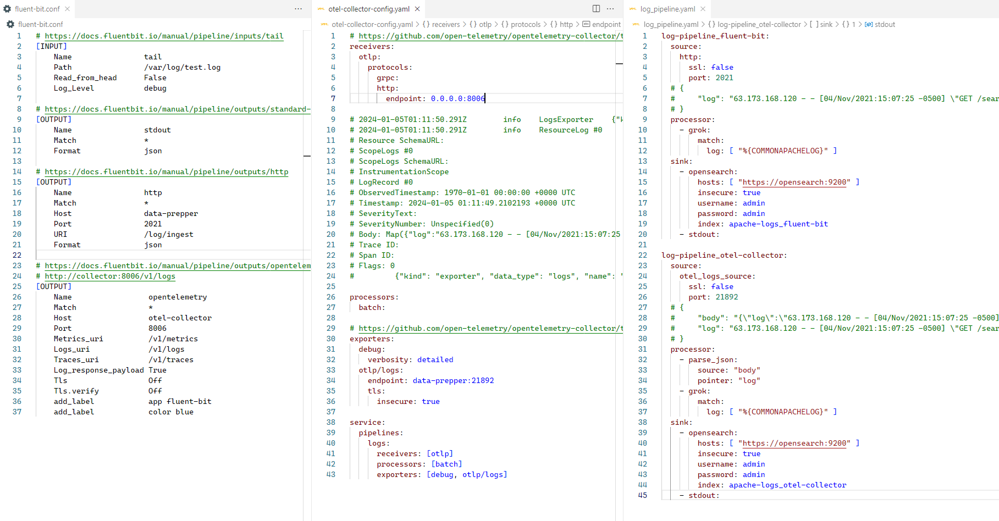
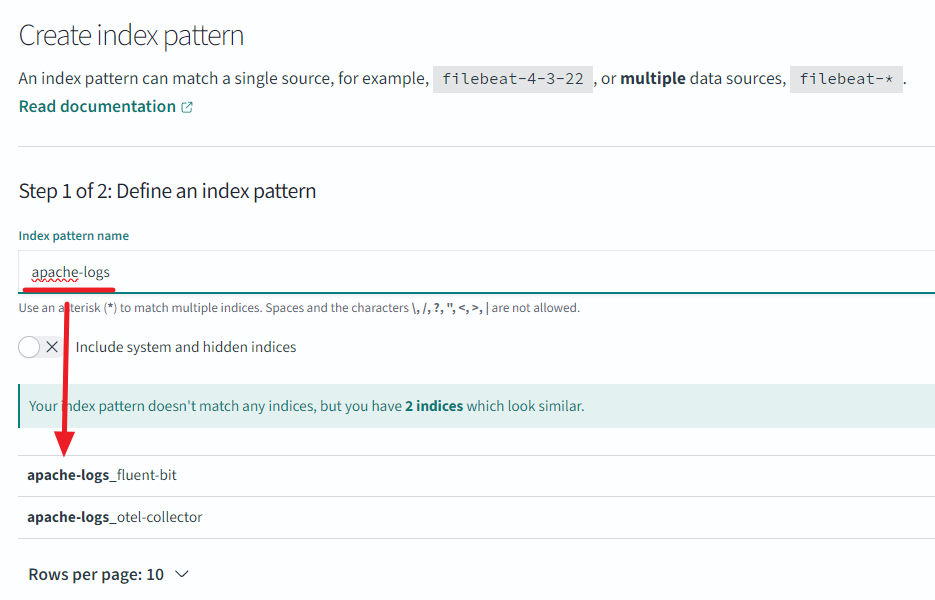

# 2024년 Weekly #01

## 개요
- opensearch 오픈소스를 이용하여 로그를 수집한다.

<br/>

## 배움
- fluent-bit을 이용한 파일 로그 수집과 전송 방법을 이해한다.
  - stdout
  - http
  - opentelemetry
- data-prepper을 다중 pipeline을 이용하여 아파치 로그 해석기를 개발한다.
  - parse_json
  - grok
- otel-collector을 이용하여 fluent-bit와 data-prepper 중계한다.

<br/>

## 시스템 구성
```
# Case 1.
fluent-bit ---------------------> data-prepper -> opensearch -> opensearch dashboards
test.log                          21890/?         9200/https    5601/http  

# Case 2.
fluent-bit --> otel-collector --> data-prepper -> opensearch -> opensearch dashboards
test.log       8080/http          21890/?         9200/https    5601/http  
```



<br/>

## 로그 데이터
### 입력 데이터
> echo '63.173.168.120 - - [04/Nov/2021:15:07:25 -0500] "GET /search/tag/list HTTP/1.0" 200 5003' >> test.log

### fluent-bit → data-prepper 데이터
```json
{
    "date": 1.704428472506444E9,

    "log": "63.173.168.120 - - [04/Nov/2021:15:07:25 -0500] \"GET /search/tag/list HTTP/1.0\" 200 5003",
    "request": "/search/tag/list",
    "auth": "-",
    "ident": "-",
    "response": "200",
    "bytes": "5003",
    "clientip": "63.173.168.120",
    "verb": "GET",
    "httpversion": "1.0",
    "timestamp": "04/Nov/2021:15:07:25 -0500"
}
```
```
  processor:
    - grok:
        match:
          log: [ "%{COMMONAPACHELOG}" ]
```

### fluent-bit → otel-collector → data-prepper 데이터
```json
{
    "traceId": "",
    "spanId": "",
    "severityText": "",
    "flags": 0,
    "time": "2024-01-05T04:21:12.506443400Z",
    "severityNumber": 0,
    "droppedAttributesCount": 0,
    "serviceName": null,
    "observedTime": "1970-01-01T00:00:00Z",
    "schemaUrl": "",
    "body": "{\"log\":\"63.173.168.120 - - [04/Nov/2021:15:07:25 -0500] \\\"GET /search/tag/list HTTP/1.0\\\" 200 5003\"}",

    "log": "63.173.168.120 - - [04/Nov/2021:15:07:25 -0500] \"GET /search/tag/list HTTP/1.0\" 200 5003",
    "request": "/search/tag/list",
    "auth": "-",
    "ident": "-",
    "response": "200",
    "bytes": "5003",
    "clientip": "63.173.168.120",
    "verb": "GET",
    "httpversion": "1.0",
    "timestamp": "04/Nov/2021:15:07:25 -0500"
}
```
```
  processor:
    - parse_json:
        source: "body"
        pointer: "log"
    - grok:
        match:
          log: [ "%{COMMONAPACHELOG}" ]
```

<br/>

## OpenSearch

